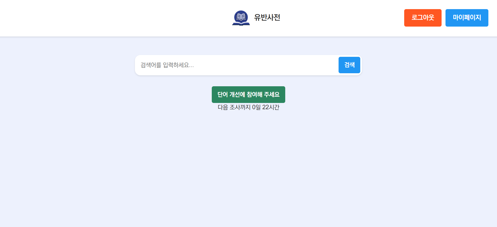
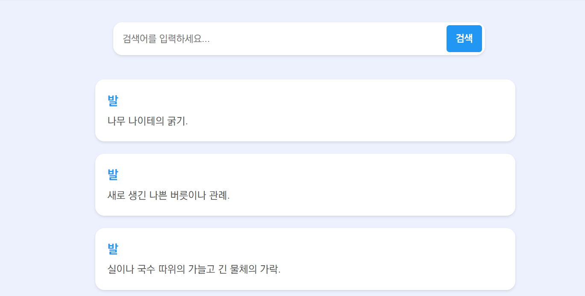
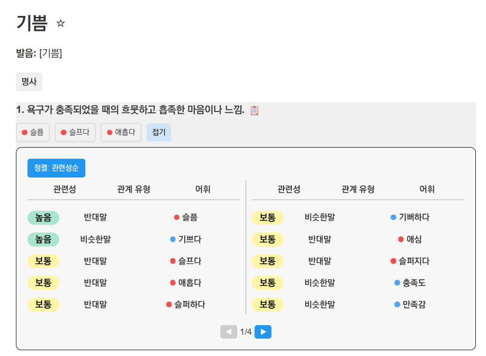
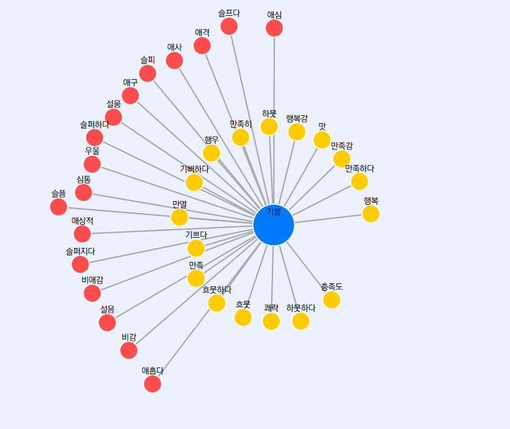
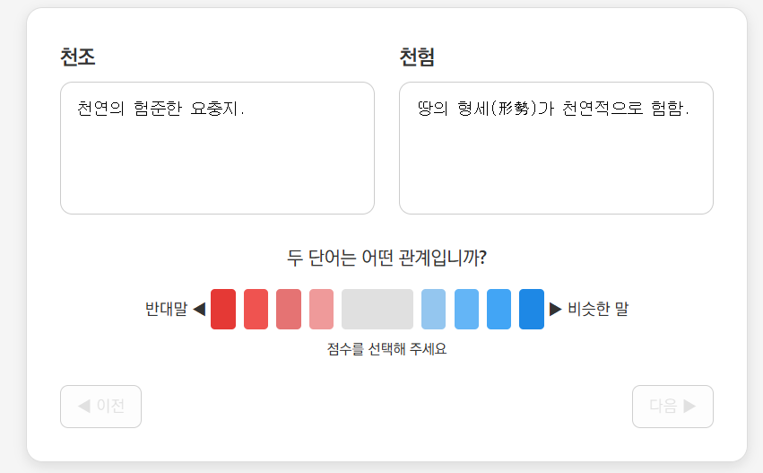
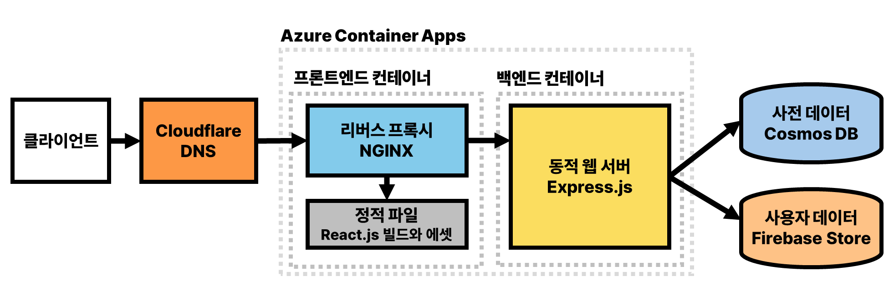

# 유반사전 — 유의어·반의어 온라인 사전 서비스

> 벡터 임베딩 기반으로 단어 간 의미적 유사도를 계산하고, 유의어·반의어 관계를 그래프로 시각화하는 웹 사전 서비스입니다.

<br>

## 📌 프로젝트 개요

| 항목 | 내용 |
|------|------|
| 진행 기간 | 2024.04 ~ 2025.06 (캡스톤 디자인 → 산학 프로젝트) |
| 팀 구성 | 4인 팀 프로젝트 |
| 담당 역할 | 백엔드 (Node.js/Express REST API) · AWS EC2 배포·운영 · 프론트엔드 (검색 결과 페이지, D3.js 시각화) |

기존 국어사전의 유의어·반의어 정보는 사람의 직관에만 의존해 연관 관계가 누락되는 경우가 잦습니다.  
이 프로젝트는 표준국어대사전 데이터를 **OpenAI text-embedding-3-large** 모델로 벡터화하고,  
단어 간 코사인 유사도를 계산해 더 풍부한 어휘 관계를 제공합니다.

<br>

## 📸 시연 화면

| 메인 페이지 | 검색 결과 페이지 |
|------------|----------------|
|  |  |

| 단어 상세 페이지 | D3.js 단어 관계 시각화 |
|----------------|----------------------|
|  |  |

| 설문 피드백 페이지 | 시스템 구조 |
|-----------------|------------|
|  |  |

<br>

## 🛠 기술 스택

### v1 — 캡스톤 디자인 (2024)
| 구분 | 기술 |
|------|------|
| Frontend | React.js, JavaScript |
| Backend | Node.js, Express.js |
| Infra | AWS EC2 (Ubuntu) |
| DB | SQLite |

### v2 — 산학 프로젝트 (2025) 고도화
| 구분 | 기술 |
|------|------|
| Frontend | React.js, D3.js |
| Backend | Node.js, Express.js, Docker |
| Infra | Azure Container Apps, NGINX (리버스 프록시) |
| DB | Azure Cosmos DB (NoSQL) |
| Auth/Data | Firebase Authentication, Firebase Firestore |

<br>

## 👩‍💻 담당 구현 (김다은)

### ✅ v1 — AWS EC2 배포·운영 (캡스톤 2024)
- AWS EC2 Ubuntu 인스턴스 환경 구성 및 Node.js 서버 배포
- 서버 실행 환경 설정 및 유지보수
- React 프론트엔드 빌드 및 정적 파일 서빙 구성
- 프론트엔드 JavaScript 코드 수정 및 기능 보완

### ✅ v1·v2 — 검색 결과 페이지 구현 및 API 연동
- `GET /api/words?word={검색어}` API 연동으로 검색 결과 표시
- 검색 결과 클릭 시 단어 상세 페이지(`/word/:wordId`)로 이동
- 로딩 상태 및 에러 상태 처리 구현
- React Router 기반 페이지 라우팅 구성

### ✅ v2 — D3.js 단어 관계 그래프 시각화 (산학 2025)
- `d3.forceSimulation` 기반 force-directed graph 구현
- 중심 노드(검색어)를 기준으로 유의어·반의어를 방사형으로 배치
- 유사도 값에 따라 노드 간 거리 동적 조정 (`distance = 200 - 100 * similarity`)
- 유의어(노란색) / 반의어(빨간색) / 중심어(파란색) 색상 구분
- 노드 클릭 시 해당 단어 상세 페이지로 이동하는 인터랙션 구현
- 노드 드래그 기능 및 hover 애니메이션 효과 적용

<br>

## 🔄 v1 → v2 주요 개선사항

| 항목 | v1 (캡스톤) | v2 (산학) |
|------|------------|----------|
| 인프라 | AWS EC2 단일 인스턴스 | Azure Container Apps (최소 0 ~ 최대 10개 자동 수평 확장) |
| DB | SQLite (평균 응답 5초) | Azure Cosmos DB (평균 응답 10ms 이내) |
| 보안 | 없음 | Cloudflare DNS (DDoS 방어) |
| 컨테이너 | 미적용 | Docker + NGINX 리버스 프록시 |
| 사용자 기능 | 기본 검색 | 로그인 · 즐겨찾기 · 검색 이력 · 피드백 시스템 |
| 시각화 | 미적용 | D3.js 단어 관계 그래프 |

<br>

## ✨ 주요 기능

**단어 검색 및 탐색**
- 유의어·반의어를 관련성순·동의어순·반의어순으로 정렬 조회
- 단어 간 하이퍼링크 및 고유 URL로 직접 이동·공유 가능

**D3.js 단어 관계 시각화**
- 검색어를 중심으로 유의어(노란색)·반의어(빨간색)를 방사형 그래프로 시각화
- 노드 클릭 시 해당 단어 상세 페이지로 바로 이동

**회원 기능**
- Firebase Google 계정 연동 로그인
- 기기 간 동기화되는 검색 이력 및 즐겨찾기 목록

**데이터 품질 개선 시스템**
- 이용자 피드백(설문·개별 피드백)을 이용자 신뢰도 가중평균으로 자동 반영
- 신뢰도 = 활동일수 × 제출 횟수 × 평균 오차로 산정 (0.105 ~ 1.0)

<br>

## 📁 프로젝트 구조

```
├── dictionary-front/              # React 프론트엔드
│   ├── src/
│   │   ├── pages/
│   │   │   ├── WordDetailPage.js  # D3.js 시각화 + 단어 상세
│   │   │   ├── SearchResultsPage.js
│   │   │   ├── MainPage.js
│   │   │   ├── MyPage.js
│   │   │   └── Feedback.js
│   │   ├── components/
│   │   │   └── Header.js
│   │   └── api.js                 # Axios API 설정
│   └── ...
└── dictionary-back/               # Node.js/Express 백엔드
    ├── index.js                   # REST API 라우터
    ├── firebaseQuery.js           # Firebase Auth 미들웨어
    └── package.json
```

<br>

## 🔌 API 명세

| Method | Endpoint | 설명 | 인증 |
|--------|----------|------|------|
| GET | `/api/words?word={검색어}` | 단어 검색 | 불필요 |
| GET | `/api/word/:wordId` | 단어 상세 조회 | 불필요 |
| GET | `/api/getsurvey` | 피드백 문항 조회 | Firebase JWT |
| POST | `/api/submitsurvey` | 세션 피드백 제출 | Firebase JWT |
| POST | `/api/submitFeedback` | 단일 어휘 피드백 제출 | Firebase JWT |

<br>

## ⚙️ 실행 방법

### 프론트엔드
```bash
cd dictionary-front
npm install
npm start
```

### 백엔드
```bash
cd dictionary-back
npm install
node index.js
# 서버 실행: http://localhost:5001
```

> ⚠️ Firebase 설정 파일(`firebase-config.js`)과 DB 데이터는 보안 및 저작권 문제로 포함되지 않습니다.  
> DB 데이터는 국립국어원 표준국어대사전 라이선스로 인해 별도 제공이 불가합니다.

<br>

## 💡 기술적 고민과 해결

**D3.js 노드 간 거리 조정**  
유사도가 높은 단어일수록 중심어에 가깝게, 낮을수록 멀게 배치하기 위해  
`forceLink`의 distance를 `200 - 100 * similarity`로 설정해 유사도에 반비례하는 거리를 구현했습니다.

**노드 클릭 내비게이션**  
D3.js 노드 클릭 이벤트와 React Router의 `navigate`를 연결해  
그래프에서 단어를 클릭하면 바로 해당 단어 상세 페이지로 이동하는 흐름을 구현했습니다.

<br>

## 👥 팀원 역할

| 이름 | 담당 |
|------|------|
| 김다은 | 백엔드 (Node.js/Express REST API), 프론트엔드 (검색 결과 페이지, D3.js 시각화), AWS EC2 배포·운영 |
| 김서현 | 프론트엔드 |
| 이서진 | UI/UX 목업, 프론트엔드 |
| 전동헌 | 단어 데이터베이스 구축, Azure Cosmos DB, 인프라 |
